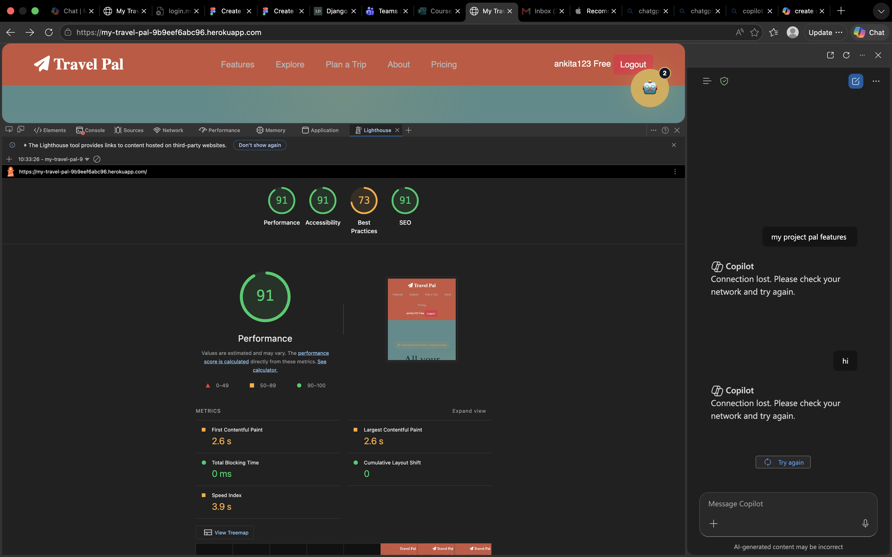

# TravelPal
My Travel Pal is a travel management web application that centralizes trip, flight, and hotel booking information in one platform. Users can import booking details using AI, view organized itineraries and calendar events, manage travel plans, and use an AI assistant for travel guidance, making trip planning simpler and more efficient.

**View Site** → [TravelPal](https://my-travel-pal-9b9eef6abc96.herokuapp.com/)

## 📚 Table of Contents

- [📌 Project Overview](#-project-overview)
- [ ErD](#-erd)
- [Flow-Chart] (#-flowChart)
- [🎯 User Stories](#-user-stories)
- [🚀 Features](#-features)
- [🖥️ Technologies Used](#️-technologies-used)
- [🎨 Front-End Design & Interactivity (LO1)](#-front-end-design--interactivity-lo1)
  - [Colour Palette](#colour-palette)
  - [Typography](#typography)
  - [Wireframes](#wireframes)
- [✅ Testing & Validation (LO2)](#-testing--validation-lo2)
- [☁️ Deployment & Version Control (LO3)](#️-deployment--version-control-lo3)
- [📚 Documentation & Code Quality (LO4)](#-documentation--code-quality-lo4)
- [⚙️ JavaScript Functionality (LO5)](#️-javascript-functionality-lo5)
- [🤖 AI Usage & Reflection (LO6)](#-ai-usage--reflection-lo6)
- [📦 Installation & Setup](#-installation--setup)
- [🚀 Deployment Instructions](#-deployment-instructions)
- [📸 Screenshots](#-screenshots)
- [🔗 API Attribution](#-api-attribution)
- [🚀 Future Improvements](#-future-improvements)
- [Lighthouse Performance](#lighthouse-performance)

---

# 📌 Project Overview
centralizes trip, flight, and hotel booking information in one platform. Users can import booking details using AI, view organized itineraries and calendar events, manage travel plans, and use an AI assistant for travel guidance, making trip planning simpler and more efficient.

## 🧾 ERD


## 🧾 User Stories

Epic 1 – Authentication
User Story: Registration

As a new user, I want to create an account so that I can access TravelPal features.

Acceptance Criteria

User can enter username, email, and password.
Password must meet validation rules.
User receives confirmation of successful registration.
Duplicate emails are not allowed.
User Story: Login

As a registered user, I want to log in securely so that I can access my travel dashboard.

Acceptance Criteria

User enters valid credentials.
Invalid credentials display an error message.
User is redirected to the dashboard after login.
Epic 2 – Trip Management
User Story: Create Trip

As a traveler, I want to create a trip so that I can organize my travel plans.

Acceptance Criteria

User can enter trip details.
Trip is saved successfully.
Trip appears on dashboard.
User can edit or delete the trip.
User Story: View Itinerary

As a traveler, I want to view all travel information in one place so that I can easily manage my journey.

Acceptance Criteria

Flights are displayed.
Hotel bookings are displayed.
Attractions are displayed.
Travel dates are shown correctly.
Epic 3 – Booking Import
User Story: AI Import

As a user, I want to upload booking confirmations so that TravelPal can automatically extract travel details.

Acceptance Criteria

User can upload PDF files.
User can upload DOCX files.
Extracted information is displayed.
Invalid files display an error message.
Epic 4 – Travel AI Assistant
User Story: Ask Travel Questions

As a traveler, I want to ask travel questions so that I receive recommendations and assistance.

Acceptance Criteria

User can enter travel-related prompts.
AI returns useful responses.
Chat history is maintained during the session.
Epic 5 – Documents
User Story: Upload Travel Documents

As a traveler, I want to store important travel documents so that they are accessible when needed.

Acceptance Criteria

Upload PDF, DOCX, XLSX, TXT, or image files.
Documents are associated with a user account.
Documents can be viewed later.


# 🚀 Features
1).Upload any file (PDF, DOCX, XLSX, TXT, Images)
📄 Extract text
🤖 Chat with uploaded documents
✈️ Travel Assistant
🍽 Restaurant recommendations
🏨 Hotel recommendations
📍 Nearby attractions
🗺 Route suggestions
🧠 Local LLM using Ollama (Free)

Architecture
travel_ai_assistant/

    User
      │
      ▼
 ┌────────────────┐
 │ Django UI      │
 └───────┬────────┘
         │
         ▼
 ┌────────────────┐
 │ Upload File    │
 └───────┬────────┘
         │
         ▼
 ┌────────────────┐
 │ Text Extractor │
 └───────┬────────┘
         │
         ▼
 ┌────────────────┐
 │ Saved Context  │
 └───────┬────────┘
         │
         ▼
 ┌────────────────┐
 │ AI Assistant   │
 └───────┬────────┘
         │
         ├── File Questions
         ├── Travel Queries
         ├── Hotel Search
         ├── Restaurant Search
         ├── Attractions
         └── Route Planning

  packages installed

pip3 install ollama
pip3 install pymupdf
pip3 install python-docx
pip3 install pandas
pip3 install openpyxl
pip3 install pillow
pip3 install pytesseract
pip3 install requests
brew install tesseract
tesseract --version
pip3 install gunicorn
pip3 install whitenoise
# save dependencis
pip3 freeze > requirements.txt
# run migrations
Run migrations: 
python3 manage.py makemigrations
python3 manage.py migrate
find . -name "sidebar.html"
# 🖥️ Technologies Used

- HTML5 for semantic structure
- CSS3 for responsive styling and layout
- JavaScript (ES6) for interactivity and API integration
- Bootstrap 5 for grid responsiveness and components
- Font Awesome for icons and UI markers
- Python
- Django
- PostgreSql

# 🎨 Front-End Design & Interactivity (LO1)

The UI emphasizes a modular dashboard with clear sections and responsive grouping.

## Colour Palette


## Typography

- Simple, readable text hierarchy
- Bold headings for section titles and UI labels
- Smaller body text for field and helper content
- Responsive typography sizing across breakpoints
The project uses one display family from [Google Fonts](https://fonts.google.com/share?selection.family=Inter:ital,opsz,wght@0,14..32,100..900;1,14..32,100..900|Roboto+Serif:ital,opsz,wght@0,8..144,100..900;1,8..144,100..900), loaded in `index.html`.

## Wireframes

The wireframes show desktop, tablet, and mobile layout structure with the updated screenshot-style design.


# ☁️ Deployment & Version Control (LO3)

- Project is prepared for GitHub Pages deployment
- Source code is tracked using Git
- Commit history should reflect incremental updates and wireframe improvements
- Deployment can be published from the `main` or `gh-pages` branch for live hosting

# 📚 Documentation & Code Quality (LO4)

- Code organization separates `index.html`, `assets/css/style.css`, and `assets/js/script.js`
- Comments are used to document major sections and interactive behavior
- File paths are consistent and static assets are grouped clearly
- README contains an overview, feature summary, and setup instructions


# 🤖 AI Usage & Reflection (LO6)

AI tools were used as an assistive resource throughout this project. Their use focused on suggestion, verification, and content generation while retaining human oversight. Key uses:

- Drafting and polishing README text, user stories, and section headings.
- Generating wireframe and mockup concepts that informed layout decisions.
- Checking JavaScript logic and suggesting improvements (I asked the AI to review functions and then validated changes manually).
- Proposing accessibility, responsiveness, and UX improvements.
- Suggesting test cases, validation checks, and debugging approaches.
- Producing concise commit-message and documentation drafts.

Responsible use and limitations:

- AI output was used as recommendations only; every code change and design decision was reviewed and tested by me before inclusion.
- I did not share any sensitive or private data with the AI.
- Where the AI influenced visuals or copy, I edited for accuracy, clarity, and consistency with project goals.

Example prompts:

 Act as my personal Travel Pal and expert travel planner.

Your role is to help me plan, organize, and optimize my trips. Based on my destination, budget, travel dates, interests, and travel style, create a complete travel plan that includes:

- Best flights and transportation options
- Accommodation recommendations
- Day-by-day itinerary
- Must-see attractions and hidden gems
- Local food recommendations
- Estimated budget breakdown
- Weather and packing suggestions
- Safety tips and local customs
- Time-saving travel hacks
- Alternative options for bad weather or budget changes

Ask relevant questions if information is missing. Present recommendations in a clear, organized format with practical travel advice. Prioritize experiences that match my interests and budget while minimizing unnecessary travel time and costs.

Destination: [Destination]
Travel Dates: [Dates]
Budget: [Budget]


# 📦 Installation & Setup

Clone the repository:

```bash
git clone https://github.com/your-username/
cd MyTravelPal
```

Open the project in a browser or use VS Code Live Server for local development.

# 🚀 Deployment Instructions

1. Push code to GitHub
2. Open repository settings
3. Select Pages
4. Choose the branch to deploy from (`main` or `gh-pages`)
5. Save and copy the generated live URL

# 📸 Screenshots

Use the wireframe images above for the updated responsive layout preview.
![Desktop]


# 🚀 Future Improvements

- Add AI Assistant for whole website
- Add itnenary


# Lighthouse Performance

- Performance: optimized asset structure and minimal resource overhead
- Accessibility: semantic HTML, readable contrast, and keyboard-friendly controls
- Best Practices: modern resource loading via CDN and structured code
- SEO: meta descriptions, titles, and meaningful content hierarchy

> Recommended: run Chrome Lighthouse for exact desktop and mobile scores.


